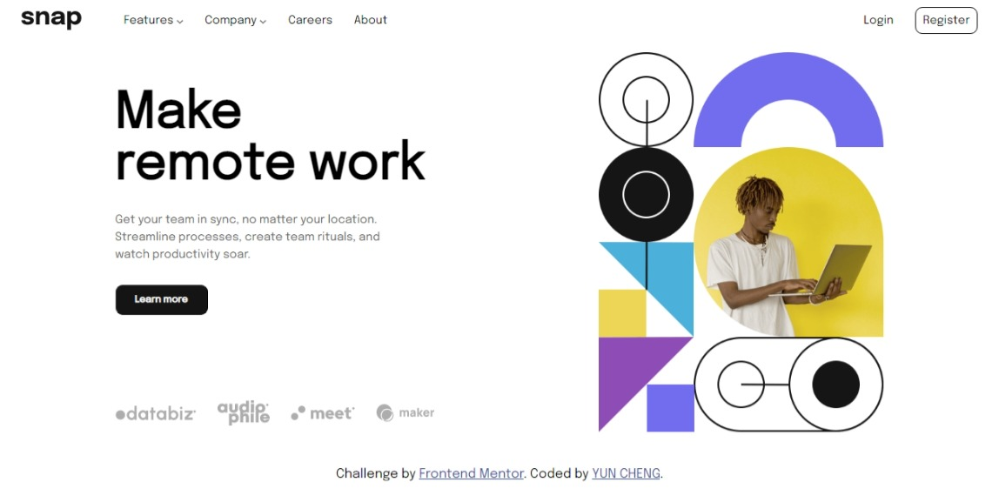

# Frontend Mentor - Intro section with dropdown navigation solution

This is a solution to the [Intro section with dropdown navigation challenge on Frontend Mentor](https://www.frontendmentor.io/challenges/intro-section-with-dropdown-navigation-ryaPetHE5).

## Table of contents

- [Overview](#overview)
  - [The challenge](#the-challenge)
  - [Screenshot](#screenshot)
  - [Links](#links)
- [My process](#my-process)
  - [Built with](#built-with)
  - [What I learned](#what-i-learned)
  - [Useful resources](#useful-resources)
- [Author](#author)

**Note: Delete this note and update the table of contents based on what sections you keep.**

## Overview

### The challenge

Users should be able to:

- View the relevant dropdown menus on desktop and mobile when interacting with the navigation links
- View the optimal layout for the content depending on their device's screen size
- See hover states for all interactive elements on the page

### Screenshot



### Links

- Solution URL: [Add solution URL here](https://your-solution-url.com)
- Live Site URL: [Add live site URL here](https://your-live-site-url.com)

## My process

### Built with

- Semantic HTML5 markup
- CSS custom properties
- Flexbox
- CSS Grid

### What I learned

 - 下拉式選單
  -display: none; 讓content先消失。
  -position: absolute; 讓content不會推移，保持在原本的位置。
  -white-space: nowrap; 讓文字空白的部分不會因為width:auto的關係向下推移。
  -之後再透過hover讓鼠標觸碰的位置顯現content。

```css
.dropdown--content {
    display: none;
    position: absolute;
    width: auto;
    white-space: nowrap;
}
.nav--click:hover .dropdown--content {
    display: block;
}
```

 - 圖片置中
  -在圖片外面的ul用display:flex讓整個上下左右皆置中，就不會受到圖片長寬不同而影響位置
```css
.section--logo ul {
    display: flex;
    justify-content: center;
    align-items: center;
}
```
### Useful resources

- [MDN white-space](https://developer.mozilla.org/zh-TW/docs/Web/CSS/white-space) - 處理文字空白。
- [How to Center an Image Vertically and Horizontally with CSS](https://www.freecodecamp.org/news/how-to-center-an-image-in-css/) - 圖片置中。

## Author

- Website - [YUN-CHENG](https://www.your-site.com)
- Frontend Mentor - [@chui359](https://www.frontendmentor.io/profile/chui359)
